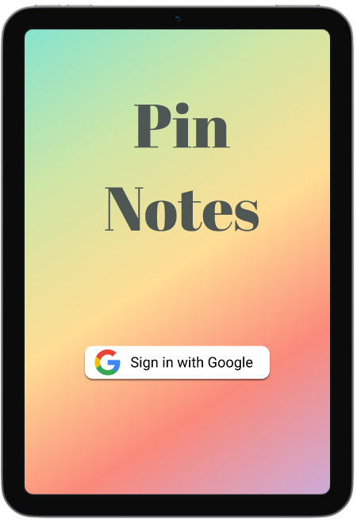
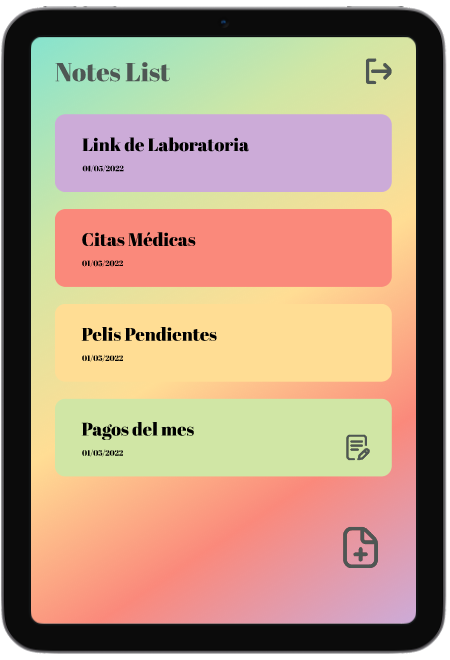
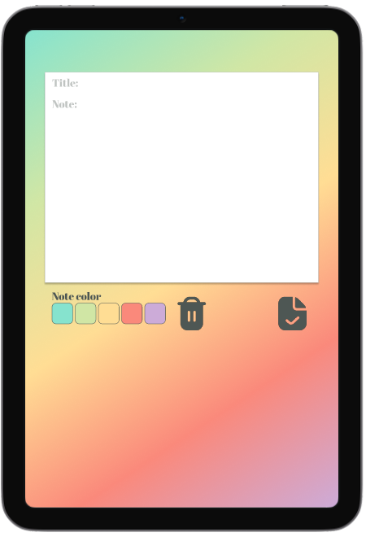

# Pin - Notes

## Índice

* [1. Resumen del Proyecto](#1-resumen-del-proyecto)
* [2. Prototipo de alta fidelidad](#2-prototipo-de-alta-fidelidad)
* [3. Consideraciones generales](#3-consideraciones-generales)
* [4. Criterios de aceptación mínimos del proyecto](#4-criterios-de-aceptación-mínimos-del-proyecto)

***

## 1. Resumen del Proyecto

En este proyecto se crea una aplicación para tomar notas, que nos permita
crear, editar, eliminar y consultarlas en cualquier momento.

No existe día que no tomemos notas, siempre necesitamos apuntar alguna
dirección, número telefónico, notas de alguna reunión o guardar nuestras URLs
favoritas para poder consultarlas más tarde. Muchas veces para esta actividad
utilizamos libretas o agendas que terminan siendo olvidadas, o anotamos de
manera dispersa de tal manera que perdemos de vista la prioridad y el propósito
de la nota lo cual da como resultado una nota perdida.

El objetivo principal de este proyecto es aprender a construir una _interfaz
web_ usando _React_. 

## 2. Prototipo de alta fidelidad

## 3. Consideraciones generales

* Este proyecto se trabajó de forma individual.

* La aplicación es una _Single Page App_. Las notas estan realizadas desde una
_tablet_, pero **no es una app nativa**, sino una web app **responsive**.

## 4. Criterios de aceptación mínimos del proyecto

### Definición del producto

La _Product Owner_ nos presenta este _backlog_ que es el resultado de su trabajo colaborativo.

***

### Historias de usuaria

#### [Historia de usuaria 1] Debería poder crear cuenta, iniciar y cerrar sesión

Yo como usuaria debo poder crear una cuenta y autenticarme usando login de
Google para acceder a mis notas.

***

#### [Historia de usuaria 2] Debería poder tomar nota

Yo como usuaria quiero tomar nota para no depender de mi mala
memoria y tener presente en todo momento los apuntes ó cosas importantes que
antes escribía en papel.

***

#### [Historia de usuaria 3] Debería poder ver las notas

Yo como usuaria quiero leer mis notas para recordar lo que escribí
antes.

***

#### [Historia de usuaria 4] Debería poder editar las notas

Yo como usuaria quiero editar notas para poder modificar lo que
escribí antes.

***

#### [Historia de usuaria 5] Debería poder borrar notas

Yo como usuaria quiero borrar una nota para no volver a verla.

***

##### Criterios de aceptación

Lo que debe ocurrir para que se satisfagan las necesidades del usuario

* Anotar un título a mi nota
* Agregar el contenido de mi nota.
* Ver todas mis notas.
* Ver la última modificación de la nota.
* Modificar las notas.
* Eliminar notas.
* Se ve y funciona bien en una _Tablet_